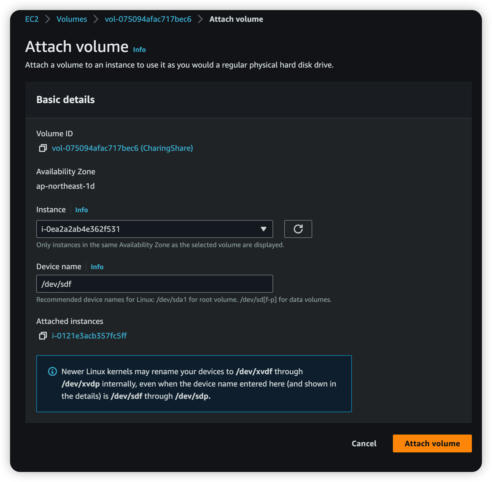

# Common Configurations

```bash

# ssh to server
ssh ubuntu@35.73.227.145

############## mount share volume ############## 
# ref.: https://docs.aws.amazon.com/AWSEC2/latest/UserGuide/ebs-using-volumes.html
sudo lsblk -f
sudo mkdir /data
sudo mount /dev/nvme1n1 /data
sudo blkid
sudo nano /etc/fstab
# UUID=06754bd0-0f44-46ad-a1f6-0fb99167f0df  /data  xfs  defaults,nofail  0  2
## Test Auto Mount
sudo umount /data
sudo mount -a
## reboot
sudo reboot
## Test Auto Mount
tail /data/test.txt

############## Swap Memory ##############
# ref.: https://www.digitalocean.com/community/tutorials/how-to-add-swap-space-on-ubuntu-20-04-ja
sudo fallocate -l 2G /swapfile
sudo chmod 600 /swapfile
sudo mkswap /swapfile
# Setting up swapspace version 1, size = 2 GiB (2147479552 bytes)
# no label, UUID=7e24b8a4-5a64-4745-b853-cd242e6425fc
sudo swapon /swapfile
echo '/swapfile none swap sw 0 0' | sudo tee -a /etc/fstab
cat /etc/fstab

############## install docker ##############
# ref.: https://docs.docker.com/engine/install/ubuntu/
sudo apt-get update
sudo apt-get install -y ca-certificates curl gnupg
sudo install -m 0755 -d /etc/apt/keyrings
curl -fsSL https://download.docker.com/linux/ubuntu/gpg | sudo gpg --dearmor -o /etc/apt/keyrings/docker.gpg
sudo chmod a+r /etc/apt/keyrings/docker.gpg
echo "deb [arch="$(dpkg --print-architecture)" signed-by=/etc/apt/keyrings/docker.gpg] https://download.docker.com/linux/ubuntu "$(. /etc/os-release && echo "$VERSION_CODENAME")" stable" | sudo tee /etc/apt/sources.list.d/docker.list > /dev/null

sudo apt-get update
sudo apt-get install docker-ce docker-ce-cli containerd.io docker-buildx-plugin docker-compose-plugin
sudo systemctl status docker.service
sudo systemctl enable docker.service

# ############## install amazon-cloudwatch-agent ##############
# sudo apt install collectd -y
# # AMD (64-bit) architecture
# curl -LO https://s3.ap-northeast-1.amazonaws.com/amazoncloudwatch-agent-ap-northeast-1/ubuntu/amd64/latest/amazon-cloudwatch-agent.deb
# # ARM (64-bit) architecture
# curl -LO https://s3.ap-northeast-1.amazonaws.com/amazoncloudwatch-agent-ap-northeast-1/ubuntu/arm64/latest/amazon-cloudwatch-agent.deb
# sudo dpkg -i -E ./amazon-cloudwatch-agent.deb
# sudo /opt/aws/amazon-cloudwatch-agent/bin/amazon-cloudwatch-agent-config-wizard
# # Do you want to monitor any log files?
# # 1. yes
# # 2. no
# # default choice: [1]:
# # Log file path:
# # /data/stg-charing-storage/logs/laravel.log
# sudo systemctl start amazon-cloudwatch-agent.service
# sudo systemctl status amazon-cloudwatch-agent.service
# sudo systemctl enable amazon-cloudwatch-agent.service

```

## Mount Share Volume on AWS 

[URL](https://ap-northeast-1.console.aws.amazon.com/ec2/home?region=ap-northeast-1#Volumes:)



# Web Server

```bash
##################### nginx ######################
sudo apt install nginx
sudo systemctl status nginx
sudo systemctl enable nginx
sudo nano /etc/nginx/sites-available/charing.biz.conf #ref: charing.biz.conf section
sudo ln -s /etc/nginx/sites-available/charing.biz.conf /etc/nginx/sites-enabled/
sudo rm /etc/nginx/sites-enabled/default
sudo nginx -t
sudo systemctl reload nginx


##################### certbot ######################

# ref.: https://www.digitalocean.com/community/tutorials/how-to-secure-nginx-with-let-s-encrypt-on-ubuntu-20-04-ja
sudo apt install certbot python3-certbot-nginx
sudo certbot --nginx -d charing.biz
cat /etc/nginx/sites-available/charing.biz.conf
sudo systemctl enable certbot.timer
sudo crontab -e
# 0 0 1 * * /usr/bin/certbot renew --quiet

##################### crontab ######################
sudo crontab -e
# * * * * * sudo docker exec $(sudo docker ps -a -q --filter="name=prd-charing-web") php artisan schedule:run >> /dev/null 2>&1
```

## charing.biz.conf

```
server {
    listen        80;
    server_name   charing.biz;
    location / {
        proxy_pass         http://localhost:5000;
        proxy_http_version 1.1;
        proxy_set_header   Upgrade $http_upgrade;
        proxy_set_header   Connection keep-alive;
        proxy_set_header   Host $host;
        proxy_cache_bypass $http_upgrade;
        proxy_set_header   X-Forwarded-For $proxy_add_x_forwarded_for;
        proxy_set_header   X-Forwarded-Proto $scheme;
    }
}
```